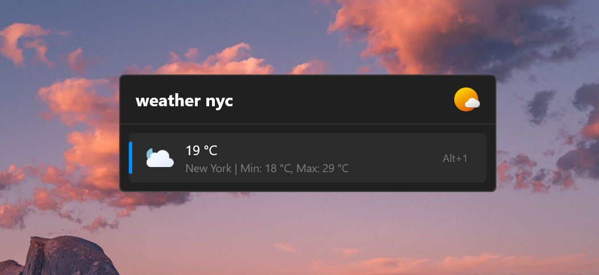

- this is **very initial** version of a [Flow Launcher](https://github.com/Flow-Launcher/Flow.Launcher) weather plugin, and it may not work as expected.
- it's not yet published to the Flow Launcher plugin store (https://github.com/Flow-Launcher/Flow.Launcher.PluginsManifest). 
- i'd like if you could improve it. 



# Install 

```
pm install https://github.com/adielBm/Flow.Launcher.Plugin.Weather/releases/download/v1.0.0/Flow.Launcher.Plugin.Weather.zip
```

# TODO

- [ ] add more info rather than only current temperature
- [x] add setting option for default city
- [x] add icons for weather codes
- [ ] fix build warnings

# Credits

- https://github.com/basmilius/weather-icons for weather icons in `Images` folder
- https://github.com/AlienDwarf/open-meteo-dotnet and https://open-meteo.com/ for weather data 

